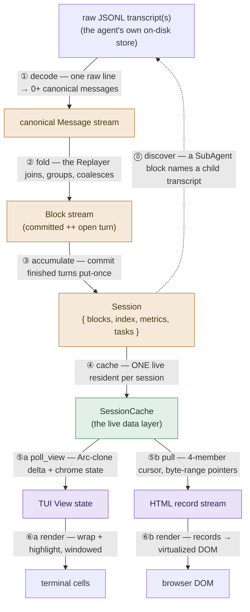

# claude-replay — Architecture

> This Markdown is the maintained source of the architecture narrative (it renders inline on
> GitHub). A **standalone, graphics-rich HTML render** of the same material lives at
> [`docs/architecture.html`](architecture.html) (and the guide at
> [`docs/developer-guide.html`](developer-guide.html)) — open locally or host; regenerate when
> the architecture changes. For the exhaustive per-object API, generate the reference with
> `cargo apidoc` (see the
> [Developer Guide](developer-guide.md#the-api-reference-auto-generated-always-in-sync)).

A developer-facing design document for the `claude-replay` workspace: the reusable transcript
**engine**, the **presentation-support layer**, and the **presenters** built on them (a
terminal viewer, an HTML export/live server, and the `agent-jdi` supervisor). For the
hands-on "how do I build/test/extend this" material — including the
**[add-an-agent walkthrough](developer-guide.md#7-adding-an-agent)** and the
**[build-your-own-frontend guide](developer-guide.md#5-level-2--build-your-own-frontend-on-core--present)**
— see the [Developer Guide](developer-guide.md).

---

## 1. What it is

`claude-replay` reads an AI coding-agent's **session transcript** (a JSONL log — Claude Code,
Codex, or QoderWork) and replays it as a readable, foldable stream of blocks: user turns,
assistant prose, thinking, tool calls with their results and diffs, sub-agent spawns,
attachments, slash commands. It is **read-only** and **fully testable headless** — no TTY
required.

Two design goals shape everything below:

1. **Modularity as compiler-enforced layering.** The engine is agent-agnostic and
   presentation-agnostic; adding an agent is one small adapter, and adding a *presentation*
   is a new crate on top of the shared support layer — in both directions, no shared code is
   touched.
2. **Leanness as a design discipline.** Memory is bounded by keeping each representation no
   longer than it must live (§8), and CPU is bounded by doing only delta work on borrowed
   threads (§10). A live session with a million-line transcript costs O(open turn) RAM on the
   server and O(viewport) rendered state in either frontend.

## 2. The workspace: four layers, five crates

```
layer 1 · ENGINE          claude-replay-core      sans-io: parse, fold, follow, discover
                                  ▲
layer 2 · PRESENTATION    claude-replay-present   session cache, sync protocol, text/highlight
          SUPPORT                 ▲                helpers, the shared Args — frontend-agnostic
                             ┌────┴────┐
layer 3 · REUSABLE      claude-replay-tui   claude-replay-html    two independent, embeddable
          FRONTENDS          └────┬────┘                          presenters
                                  ▲
layer 4 · APP SHELL       claude-replay           the thin binary: clap CLI + agent-jdi
```

Each boundary is a **compiler-enforced invariant**, not a convention:

| crate | may depend on | must NOT contain |
|---|---|---|
| `claude-replay-core` | `serde`/`serde_json`, `anyhow` | any I/O policy, ratatui, syntect, clap, HTML |
| `claude-replay-present` | core (+ syntect; ratatui *types only*, no backend) | a terminal, an HTTP server, clap (unless the `cli` feature is on) |
| `claude-replay-tui` | core + present + ratatui/crossterm | HTML |
| `claude-replay-html` | core + present | any terminal dep (verified: zero crossterm/nucleo/arboard in its tree) |

The three levels of reuse this buys (each is a real, supported consumer story — worked
examples in the [Developer Guide §4–6](developer-guide.md)):

1. **Core alone** — parse/analyze transcripts in any program (`serde_json` + `anyhow` is the
   whole dependency bill).
2. **Core + present** — build a *new* frontend (native app, web service, notebook widget):
   the session cache, the incremental pull protocol with both halves implemented, fold
   policy, summaries, and highlighting are all reusable without adopting either existing UI.
3. **The finished presenters** — embed the TUI (`app::run`, or drive `View` directly) or the
   HTML exporter/server (`dump_html`/`dump_all_html`/`serve`) from your own binary.

Internally, each crate re-exports the layers below it at its own root (`crate::model`,
`crate::present`, …) — the same transparency trick at every boundary, so moved code reads as
if the split weren't there. One workspace version, bumped in one place.

## 3. The pipeline

Everything in the workspace is a stage on one data path (or a cache beside it). The colors
map stages to layers — <span style="color:#b9741f">**engine**</span> (core),
<span style="color:#3f9163">**presentation support**</span> (present),
<span style="color:#7a5bd0">**frontends**</span> — loosely: a stage's *machinery* lives in
that layer even where its types come from below. The dashed back-edge is what makes
sub-agent trees work: a parsed session can name further raw transcripts, which run the same
pipeline recursively.



| stage | contract | code |
|---|---|---|
| ⓪ discover | find transcripts by path / id / cwd — and resolve a `SubAgent` block to its child transcript (the recursive back-edge). Cwd auto-discovery is scoped strictly inside `$HOME`. | `core::discover` |
| ① decode | one raw line → 0+ canonical `Message`s; the only stage that knows an agent's field names ("L1") | `TranscriptAdapter::decode_line` |
| ② fold | the shared replay ("L2"): back-patching, turn grouping, span coalescing, the queued-prompt lifecycle — §5 below | `engine::replay::Replayer` + per-agent `Shaping` |
| ③ accumulate | the durability frontier: finished turns drained *put-once* into a `BlockStore`; index, metrics and tasks folded alongside — §6 below | `engine::builder::SessionAccumulator` |
| ④ cache | ONE live resident kind per session, serving both consumption styles; registered → resident → hibernated residency | `present::cache::SessionCache` |
| ⑤a poll_view | in-process: ONE call — advance, splice-shaped `Arc` delta, times/metrics/tasks | `SharedSession::poll_view` → `tui::View::apply_view` |
| ⑤b pull | cross-process: per-client stateless replies against a client-held 4-member cursor — §9 below | `SharedSession::pull` · `PullClient` |
| ⑥a render | blocks → styled wrapped lines, materialized only near the viewport | `tui::render` + `present::highlight`; the `hot` window |
| ⑥b render | wire records → a windowed DOM | `html/export.js` virtualizes |

## 4. The per-agent seam

Everything that varies by agent is behind **one trait**, `TranscriptAdapter` (`adapter.rs`),
resolved through a tiny registry (`adapter(agent)` / `adapters()`). The hooks:

| Hook | Role | Default |
|------|------|---------|
| `agent()` | which `Agent` | — |
| `sniff(head)` | `SniffClaim::{Owns, CanParse, No}` — format *ownership* vs mere compatibility (drives `detect_agent` and the picker's "compatible" badge) | — |
| `store_contains(path)` | provenance: is this path inside my on-disk store? (ownership without a format marker) | `false` |
| `scan_join_ids(path)` | pass-1: the tool-call ids a later result joins onto | — |
| `decode_line(line, cwd, out)` | **L1**: raw line → 0+ canonical `Message`s | — |
| `shaping()` | the L2 `Shaping` const (4 fn-pointers) | — |
| `metrics_acc()` | a fresh token/cost accumulator | — |
| `candidates_scoped(cwd)` | discovery: sessions for a cwd | — |
| `resolve_id(id)` | discovery: id → transcript path | — |
| `load_tasks(path)` | the session's task/todo list from the agent's store | `None` |
| `parse_path_timed(path, times)` | whole-file parse | **provided** (composes the hooks) |
| `parse_reader(reader)` | metrics-only fold | **provided** |
| `enrich(path, blocks)` | load the sub-agent tree | **no-op** |
| `subagent_source(root, id)` | a child transcript's path | **None** |

Everything agent-neutral reaches per-agent behavior *only* through the registry — there is no
`match agent` scattered across the engine. Three adapters exist today and demonstrate the
cost floor: Claude (full), Codex (no sub-agent tree ⇒ omits those hooks), QoderWork (delegates
decoding to Claude's modules entirely; its adapter is discovery + identity).

> The `agent-jdi` supervisor mirrors this with its own `jdi::agent::AgentAdapter` registry.

### Discovery, precisely

`discover.rs` is the agent-neutral front door for *finding* transcripts: `detect_agent`
(sniff + store provenance → ownership, so a merely-*compatible* file is labeled, not
mislabeled), `session_cwd`/`session_id`, `candidates_all` (the cross-agent picker list),
`resolve_any` (id/path/latest → a path), `session_tasks`, and `subagent_source`. Cwd-based
auto-discovery is scoped **strictly inside `$HOME`** (`ancestors_below`): a cwd outside it
probes nothing, and the probe never reaches `$HOME`'s own slug — so stores polluted by
misbehaving agents (sessions recorded against `$HOME` or `/`) can never leak into an
unrelated directory's picker. Explicit paths and ids are never scoped.

## 5. The fold: what the Replayer actually does

Stage ② looks like one arrow; it is where most of the engine's hard-won correctness lives.
A transcript is not a clean event log — results arrive out of order, turns interleave, and
what an agent's own UI *shows* differs from what it *records*. The `Replayer` reconciles all
of it, once, for every agent:

- **Result joining & back-patching.** A tool's result lands as a separate later event — the
  fold attaches it to its call *in place*, even when the call was emitted in an earlier
  poll (the follower back-patches across polls without re-parsing).
- **Turn grouping & span coalescing.** Consecutive thinking bursts and "activity" tool
  calls between two visible outputs fold into ONE work-span block, with summed durations
  and Claude-Code-faithful phrasing — an empirically derived rule set
  ([`design/cc-activity-coalescing.md`](../design/cc-activity-coalescing.md)) that agents
  opt into per adapter (`Shaping::finish_turns`).
- **The queued-prompt lifecycle.** A mid-turn human prompt is recorded when *submitted* but
  displayed when *picked up*; the fold runs that little state machine (suppressing the
  marker when pickup is immediate).
- **The committed/open split.** The fold maintains a **durability frontier**: blocks of
  finished turns are final and never touched again; only the open turn is re-derived as
  events arrive. Every incremental surface in the workspace — `changed_from`, the cursor
  protocol's generations, the put-once stores — leans on this invariant.
- **Reshape detection.** A raw-level pure append can still REWRITE the finalized open
  turn's prefix (a new tool joins a span and absorbs earlier blocks). The live layer diffs
  the finalized view per tick to catch exactly this — it is why the sync protocol has a
  *generation* member, not just an append cursor.

The proof obligations are pinned in tests: the streaming fold is byte-identical to frozen
whole-file oracles, and the follower to a full re-parse at every append.

## 6. The sans-io accumulator — one fold, every acquisition mode

The engine's heart deliberately does **no I/O**. [`SessionAccumulator`]
(`engine/builder.rs`) is a push-based fold: the *caller* acquires bytes however it likes and
pushes lines in; the accumulator threads them through L1 → L2 → metrics behind one method:

```rust
let mut acc = SessionAccumulator::new(Agent::Claude);   // or ::with_store(agent, store)
acc.advance_at(byte_offset, &line);                     // push one line — that's the I/O seam
let session = acc.into_session();                       // finish: takes the Session BY MOVE
```

`byte_offset` is the line's position in the raw transcript — the fold stamps it into
**locators** for content it deliberately does *not* inline (an attachment's bytes, a
sub-agent's file), so presenters can lazy-load from the raw transcript later instead of the
parse carrying everything. And the ending is a **move**: `into_session()` transfers the
committed values out and borrows content only to build the derived index — zero block
clones for the in-memory and `Arc` stores. (`snapshot()` exists too, as the *mid-flight*
copy for a fold that keeps going — the live follower's surface, not the one-shot ending.)

Under the hood, each pushed line runs the whole per-line pipeline: decode (L1) → fold (L2)
→ drain any turns that crossed the durability frontier **put-once** into the `BlockStore` →
fold the same blocks into the maintained live header (`SessionMeta`) and the metrics/task
accumulators. Nothing is rescanned later: `into_session`/`snapshot` assemble the `Session`
from state the fold maintained as it went — the derived `SessionIndex` is the only
end-of-parse pass.

Because byte acquisition is the caller's job, **every parse path in the workspace is the same
fold**, differing only in who feeds it:

| consumer | who pushes lines | why it matters |
|---|---|---|
| `parse_session_as` (batch) | a file reader, one line resident | whole-file parse never builds a `Vec<String>` |
| [`FollowParser`] (live tail) | the byte-offset `tail::LineReader`, only appended bytes | O(delta) per poll; proven byte-identical to a full re-parse |
| `SharedSession` (live server) | the follower, on a *client's request thread* | see §10 — no server-side polling loop |
| your code | a socket, an mmap, a test vector, a decompressor | the library never dictates your I/O |

The accumulator also owns the **durability frontier** that the whole leanness story hangs on:
as each turn completes, its blocks are drained **put-once** into a pluggable [`BlockStore`]
`S` (`committed: Vec<S::Bv>`), while the replayer retains only the **open turn** — so the
fold's resident content is O(turn) regardless of session length. Storage policy is injected,
not baked in:

- `InMemoryStore` (default) — committed blocks resident in RAM (`Bv = Block`).
- `TierBStore` (`engine/tier_b.rs`) — committed *content* serialized append-only to an
  off-heap buffer or an on-disk file; `Bv = Deferred { offset, size }`, a 12-byte locator.
  Reading a block back is a positional read + decode, dropped after use.
- `ArcStore` (#84) — committed blocks live behind `Arc` (`Bv = Arc<Block>`): the accumulator
  retains the authoritative copy, and handing a block to a reader is a refcount bump. The
  store behind the one-copy/source-of-truth principles (§8).
- …or the presentation's own: the html crate's `RecordStore` renders each block to its wire
  record at `put` time (`Bv = RecordLocator` — the §7 showcase).

Incremental facts are maintained the same way: `session_meta()` folds the live header
(turns/tools/children) once per committed block on drain, and `stream_read(from)` hands a
live consumer `committed[from..]` + the open turn — O(delta), never an O(N) rescan.

## 7. The data model

The presenter-facing vocabulary lives in `model.rs` and is the stable public API.

- **[`Block`]** — one render unit. Variants: `UserText`, `AssistantText`, `Thinking { text,
  duration_secs, tools }`, `ToolUse { name, target, diffs, output, patch, read_lines }`,
  `ToolResult`, `Attachment`, `SubAgent`, `AgentDone`, `Command`, `QueueEvent`. Tool results
  are already joined onto their calls; nothing is dropped or truncated (what shows collapsed
  is a *view* decision, not a parse decision).
- **[`Session<BV = Block>`]** — the whole parse: `{ agent, cwd, blocks, user_times, metrics,
  index, tasks }`. Generic over the block representation: `Session<Block>` is fully resident;
  `Session<Deferred>` holds only the locator table (content in a tier-b backing) and reads
  blocks back through the [`BlockAccess`] trait.
- **[`SessionIndex`]** — derived within-session rollups (turns, sub-agents, tool counts,
  attachments) computed in one scan, so presenters don't re-walk the blocks.
- **[`Metrics`]** — token/cost tally + a formatted footer.
- **Classification** — `block_kind(&Block) -> BlockKind`, projected to a coarse `fold_key`
  (fold grouping — and the key of core's `FoldPolicy`) and a fine `BlockKind::html`
  (styling). One classifier, two projections — the TUI and HTML can't disagree on what a
  block *is*.

### Showcase: `Session<BV>` in the live HTML server

**The presentation layer decides what lives in `BV`** — the block itself, auxiliary per-block
state the presentation needs, a pointer into a file the presentation maintains, a deferred
block locator, or any combination. The live server is the full expression of that principle
(#74): its `BlockStore` is the HTML crate's own `RecordStore`, whose `put` renders each
committed block to its **wire-format JSON record** exactly once — as it crosses the
durability frontier — appends it to `<id>.records`, and returns the locator. The `Session`'s
committed table *is* the wire projection:

```
SharedSession<RecordStore>  (present, parameterized by the html crate)
  Session<RecordLocator>
    committed: Vec<RecordLocator{offset,len}> ──▶  <id>.records
                                                   (rendered wire JSON, one record per line —
                                                    the ONLY committed storage)
```

- **One storage, one serialization.** Nothing is stored twice: there is no separate block
  backing and no parallel render cache — the store and the session are one object, so they
  cannot desync. Read-back is deliberately impossible (`RecordStore` implements `BlockStore`
  but not `BlockRead` — a wire record is a one-way projection), and the type system keeps
  every committed consumer on the pointer path. The TUI/batch side instantiates the same
  parameter with `BV = Block` (`InMemoryStore`); a lossless spill store (`TierBStore`,
  `BV = Deferred`) remains available to any consumer that needs `Block`s back.
- **Clients read the projection directly; the serving path burns no CPU on it.** A `/pull`
  reply renders **only the open turn**; the committed zone is answered with a pointer —
  `committed_ext: {offset, len}` — and the client range-reads the wire JSON straight off
  `<id>.records` via `/records`. The main serving function never re-renders, re-serializes,
  or even copies committed content: a session with a thousand committed blocks and a
  three-block open turn costs a poll three blocks of render and the client one `pread`.
- **Hibernation carries the projection.** An evicted resident's sidecar stores the locator
  table plus the store's render continuation (`EmitState`); restore reopens the log
  read-only — no re-render, no re-fold, and outstanding client cursors stay valid.

## 8. Lean memory: a ladder of representations, each windowed

The memory design is one idea applied five times: **every representation is kept only as
long, and only as wide, as its consumer needs**. Data climbs this ladder, and each rung holds
a *window*, not the session:

```
  transcript bytes (agent's store, disk)     resident: none — byte-offset tail reads deltas
      │  L1 decode (one line at a time)
  canonical Message                          resident: ~1 line's worth, transient
      │  L2 fold (Replayer)
  Block — open turn                          resident: O(turn) in the accumulator
  Block — committed                          resident: policy! InMemoryStore = RAM ·
      │                                        TierBStore = 12-byte locators, content on disk ·
      │                                        RecordStore = wire-record locators (#74) ·
      │                                        ArcStore = Arc-shared content, ONE copy that the
      │                                        cache owns and every reader references (#84)
      │  presentation shaping (fold policy, summaries, records/lines)
  presentation-friendly form                 TUI: heights+prefix (O(N) small ints);
      │                                        HTML: JSON records (client), record log (server)
      │  render
  rendered result                            TUI: `hot` window ≈ 96 blocks near the viewport;
                                             HTML: DOM window ≈ viewport ± 1500px
```

The windows at the top rung deserve emphasis, because both frontends independently converged
on the same structure — an O(N) *index* of cheap integers plus an O(viewport) cache of
expensive rendered output:

- **TUI** (`view.rs`): `heights: Vec<usize>` (wrapped height per block at the current width
  and fold state) + `prefix` sums make scroll math a binary search — but **rendered styled
  lines are NOT retained per block**. The only styled-line residency is `hot`, a bounded map
  (cap 96 blocks, evicted by distance from the viewport ± 8) filled on demand. A deliberate
  asymmetry: `search_text` keeps plain text for ALL wrapped lines (content-sized, cheap, and
  search must see everything) while styling stays windowed.
- **HTML client** (`html/export.js`): the JSON `records[]` array is the source of truth; the
  DOM holds only records within ~1500px of the viewport between two spacer `<div>`s whose
  heights are estimated then measured (prefix sums + binary search again). Eviction is
  lossless because interaction state (folds, search cursor, expansions) lives in id-keyed
  maps beside the records, re-applied on re-materialization. The full technique write-up:
  [`design/dom-virtualization.md`](../design/dom-virtualization.md).
- **HTML server** (`serve.rs` + `cache/`): a followed session's resident footprint is
  O(open turn) + a locator table — the `Session`'s own `RecordStore` renders each committed
  block to its wire record put-once (#74, §7 showcase), and the committed zone is served as
  a **pointer** (`committed_ext: {offset, len}`) that clients range-read from the append-only
  record log at their own pace (one serialization on disk, zero in RAM, N readers).

### The unified data layer: `SessionCache<P, A>`

Five principles govern this layer (settled in #84, and worth stating because every seam
below follows from them): **(1)** at most ONE full in-memory presentation copy per client
application instance — it exists to make search fast, and search runs over it; **(2)** the
`SessionCache` owns the SOURCE OF TRUTH of that copy — ownership, not storage medium: the
TUI's is the RAM blocks the in-process view references, the HTML server's is the on-disk
wire-record log its browser clients resync from; **(3)** therefore views never own blocks
(else principle 1+2 would force a wasteful disk mirror for the in-process case); **(4)** the
presentation format is each frontend's fastest-final-render form — `Block`s for the TUI,
DOM-loadable wire JSON for HTML — chosen at the `BlockStore` seam; **(5)** only FINAL
rendered results (and viewport neighbors) live under a view: the hot window / DOM window,
plus small derived indexes (geometry, fold state) in the aux sidecar.

Everything above meets in one owner. [`SessionCache`] is **the data layer a presentation
builds on** — it answers "which sessions exist, which are materialized, in what
representation, with what derived state attached" — and its three type parameters are the
three decisions a frontend gets to make without losing generality *or* efficiency:

| seam | decides | the menu |
|---|---|---|
| `P: BlockStore` | the live store — the ONE resident kind's committed representation (#85: one tier serves both consumption styles) | `ArcStore` (cache-owned shared copy — the TUI) · the html crate's `RecordStore` (the wire projection itself, #74) · `TierBStore` (lossless spill) |
| `A` | the per-session **presentation sidecar** | any type — park-and-take (`aux_put`/`aux_take`) or in-place (`aux_with`) |

The residency tiers under it (#85: ONE live tier — the same resident serves the in-process
view and the wire protocol):

| tier | holds | cost | transition |
|---|---|---|---|
| (c) registered | agent + path | ~nothing | the default for a discovered-but-unopened session (a large sub-agent tree stays here) |
| (a) live resident | a `SharedSession<P>` | O(turn) + tables (+ disk backing per `P`) | polled recently; reaped to (c) after 30 s idle — a `PersistentStore` resident **hibernates** its serving state on eviction, so revisiting an *unchanged* session restores (same epoch/gen — clients' cursors stay valid) instead of re-folding |

And the consumption protocols, each matched to a representation by the type system
(a capability bound, not a convention):

| protocol | shape | requires | copies of committed blocks | per-tick cost |
|---|---|---|---|---|
| `poll_view(id)` — in-process | ONE call: advance + splice-shaped `Arc` delta + times/metrics/tasks | `P = ArcStore` | **1 — cache-owned, view-referenced** | **O(delta)** |
| `shared_session(id)` + `pull` — wire | cursor zones / byte-range pointers | any `P` | 1 (or 0 in RAM with `RecordStore`) | O(open turn) |

(Whole-`Session` consumers use the core's own follower — `FollowParser::poll`/`poll_delta`
— or batch `parse_session`; the cache's job is live residency, and its two protocols share
one resident and ONE implementation of "what changed since last tick".)

Both frontends instantiate the same type — that is the "unified without losing generality"
claim made concrete:

```rust
// TUI (app.rs):  the View is the sole block owner; evicted frames park their derived state
type TuiCache = SessionCache<ArcStore, ViewSidecar>;   // every parameter doing chosen work
// HTML server (serve.rs):  committed IS the wire projection; per-id serve state lives in aux
cache: SessionCache<RecordStore, ServeAux>
```

The **sidecar slot** (#75) completes the story: it is the home for derived,
view-parameter-*dependent* state that `put`-once storage can't hold. The TUI parks an
evicted frame's measured heights/prefix, search index, fold toggles, and scroll there
(`ViewSidecar`) and re-adopts them when the frame reloads — same width and shape means no
re-measure, and the user's interaction state survives the eviction. The HTML server keeps
its per-session titles, parent pointers, and stream-diff baselines there (`ServeAux`, #76).
The slot is opaque to the cache; **the consumer owns validity**.

The TUI applies the same thinking one level up: sub-agent frames you drill into are kept
under an LRU cap of 4 (`MAX_RESIDENT_SUBAGENTS`); ancestors evict to registrations and
reload on demand — with the sidecar, an eviction now drops only the blocks.

## 9. The sync protocol: a 4-member cursor

The wire half of the data layer is a client-server sync protocol designed so the **server
keeps no per-client state**: the client's whole position travels with each request as four
numbers — `Cursor { epoch, committed_id, provisional_gen, provisional_index }`:

- **`committed_id`** — how far into the append-only committed log the client has read.
  Committed content is sent once, ever — and as a **byte-range pointer** into the on-disk
  wire-record log, which the client range-reads itself.
- **`provisional_gen` / `provisional_index`** — the open turn's *generation* and the
  client's position within it. Within a generation the served open turn is append-only; a
  back-patch or a finalization reshape bumps the gen, telling the client to replace the
  whole (small) zone. This is the reshape-detection invariant from §5 surfacing on the
  wire.
- **`epoch`** — session validity: a truncation/rewrite bumps it, and any stale cursor
  resyncs from zero — served from the cache's retained copy, never by re-parsing.

The client applies one rule per zone — *truncate to `from`, then extend* — and both halves
ship in Rust: [`pull`] (server) and [`PullClient`] (the executable specification, walked
through every transition by its tests; the embedded JS client mirrors it one for one). N
windows, laggy tabs, and fresh joiners all work against one shared log at their own pace.

## 10. Lean CPU: borrowed threads and delta-only protocols

**No dedicated work happens when nothing changed, and almost no thread exists solely to
wait.** Two mechanisms:

**Borrowed-thread tailing.** Neither frontend runs a follower thread:

- The **TUI** pumps the live tail on its *input event loop*: when `event::poll(250 ms)` times
  out with no keystroke, the idle tick calls `cache.poll_view(id)` — so tailing costs zero
  threads and zero work while the user is interacting flat-out, and at most 4 polls/s idle.
- The **HTML server** (pull mode, the default) has **no background tailer at all**: the fold
  advances on the *client's request thread* (`/pull` → `SharedSession.advance()` → reply).
  An idle page = an idle server; a closed page costs nothing until the 30 s reap tidies the
  resident. The accept loop is one detached thread; connections are thread-per-request on
  loopback.

**Delta-only protocols, at both distances.** The committed/open split (§5) makes "what
changed?" answerable in O(turn), and both consumption protocols exploit it:

- In-process: `SharedSession::poll_view` hands the TUI everything in ONE call — a
  splice-shaped delta of `Arc` clones (the resident RETAINS the authoritative committed
  vector — the cache-owned source of truth), the fresh open turn, `changed_from`, and the
  chrome state (times/metrics/tasks). `View::apply_view` splices pointers in place and
  re-derives only the tail: O(delta) refcount bumps and re-measure, content stored ONCE,
  resync-from-zero served from memory (#84/#85). The change boundary and the wire
  protocol's gen bumps come from the SAME reshape comparison — one implementation.
- Cross-process: the **4-tuple cursor protocol** (`present::cache::stream`) — `Cursor
  { epoch, committed_id, provisional_gen, provisional_index }`. The cursor travels with each
  request, so the server is **per-client stateless** and N tabs/windows each read at their
  own pace; committed data is a pure append (sent once, or range-read from the record log),
  and only the open turn ever re-sends (gen bump). Both halves are implemented in Rust:
  [`pull`] (server) and [`PullClient`] (client — the executable specification the JS client
  mirrors transition-for-transition, and the ready-made consumer for a future decoupled TUI).
  A caught-up client's pull is idle: one `pull_indices` length-check, no clone, no render.

The same discipline shows up smaller: pass-1 id scan is a cheap stream; `put`-once into the
block store (never re-serialize committed content); `session_meta` folded per commit rather
than rescanned; the HTML emitter diffs block lines and re-sends only from the first
divergence; the DOM reconciler batches reads/writes to avoid layout thrash.

## 11. Invariants the codebase holds itself to

- **Crate boundaries** — the §2 table is enforced by the dependency graph, not review.
- **Agent-agnostic everything above L1** — no presenter or shared-engine code matches on
  `Agent` for behavior; it routes through the adapter registry.
- **Byte-identical refactors** — the streaming parse is proven identical to frozen oracles
  (`#[cfg(test)]` equivalence gates in the agent `model` families), the follower to a full
  re-parse at every append, and every change runs `scripts/gate/gate.sh` — a frozen-fixture
  `--dump`/`--dump-html`/bundle diff that must print `BYTE-IDENTICAL: PASS`.
- **One classifier / one fold / one phrasing** — block classification, the L2 fold, and the
  summary vocabulary (`core::summary`) exist once; per-agent difference lives only in
  `decode_line` + `Shaping` (see
  [`design/fold-coalesce-summarize-extensibility.md`](../design/fold-coalesce-summarize-extensibility.md)).
- **Protocol equivalence** — `SharedSession` pulls are asserted identical across storage
  backings (RAM vs tier-b), and `PullClient` is walked through every protocol transition
  against the server half.

## 12. Where things live

| Path | What |
|------|------|
| `claude-replay-core/src/model.rs` | `Block` model + classification |
| `claude-replay-core/src/engine/replay.rs` | L2 `Replayer`/`Shaping`/`parse_stream` |
| `claude-replay-core/src/engine/builder.rs` | `SessionAccumulator` (sans-io fold) + `StreamRead` |
| `claude-replay-core/src/engine/{message,session,index,tasks,tier_b,path,time}.rs` | canonical log · `Session<BV>`/`BlockStore`/`BlockAccess` · rollups · task model · tier-b backing · helpers |
| `claude-replay-core/src/adapter.rs` | `TranscriptAdapter` trait + registry + `SniffClaim` |
| `claude-replay-core/src/agents/{claude,codex}/model.rs` | L1 tokenizers + `Shaping` |
| `claude-replay-core/src/agents/{claude,codex}/metrics.rs` | token/cost folding |
| `claude-replay-core/src/agents/{claude,codex,qoderwork}/discover.rs` | per-agent transcript stores |
| `claude-replay-core/src/engine/seam.rs` | the audited adapter contract — all `agents/**` may import (#87) |
| `claude-replay-core/src/{discover,metrics,follow,tail,agent,fold,summary,diff}.rs` | discovery facade · metrics · live follower · byte-offset tail · `Agent` · fold policy · span phrasing · diff-row model |
| `claude-replay-present/src/cache/{mod,shared}.rs` | `SessionCache` residency · `SharedSession` (+hibernation) |
| `claude-replay-present/src/pull.rs` | the pull protocol (`Cursor`/`PullReply`/`pull`/`PullClient`) (#87) |
| `claude-replay-present/src/{present,highlight,sys,args}.rs` | text formatters · syntect highlighter · OS/path helpers · shared `Args` (`cli` feature) |
| `claude-replay-tui/src/{view,app,render,markdown,wrap,theme,picker,clipboard}.rs` | the terminal viewer |
| `claude-replay-html/src/html_export/{mod,bundle,serve,record_store}.rs` + `src/html/` | HTML render core · offline writers · live server · the wire-projection `RecordStore` (#74) · embedded CSS/JS |
| `src/jdi/` | the `agent-jdi` supervisor (see `src/jdi/DESIGN.md`) |

[`Block`]: ../claude-replay-core/src/model.rs
[`Message`]: ../claude-replay-core/src/engine/message.rs
[`Session<BV = Block>`]: ../claude-replay-core/src/engine/session.rs
[`BlockAccess`]: ../claude-replay-core/src/engine/session.rs
[`BlockStore`]: ../claude-replay-core/src/engine/session.rs
[`SessionIndex`]: ../claude-replay-core/src/engine/index.rs
[`Metrics`]: ../claude-replay-core/src/metrics.rs
[`FollowParser`]: ../claude-replay-core/src/follow.rs
[`SessionAccumulator`]: ../claude-replay-core/src/engine/builder.rs
[`SessionCache`]: ../claude-replay-present/src/cache/mod.rs
[`pull`]: ../claude-replay-present/src/pull.rs
[`PullClient`]: ../claude-replay-present/src/pull.rs
