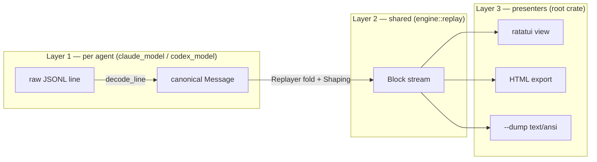

# claude-replay — Architecture

> This Markdown is the maintained source of the architecture narrative (it renders inline on
> GitHub). A **standalone, graphics-rich HTML render** of the same material — the pipeline
> diagram, the block-glyph legend, a diff sample, both light/dark — lives at
> [`docs/architecture.html`](architecture.html); open it locally or host it. For the
> exhaustive per-object API, generate the reference with `cargo apidoc` (see the
> [Developer Guide](developer-guide.md#the-api-reference-auto-generated-always-in-sync)).

A developer-facing design document for the `claude-replay` workspace: the reusable
transcript **engine** and the **presenters** built on it (a terminal viewer, an HTML export,
and the `agent-jdi` supervisor). For the hands-on "how do I build/test/extend this" material
— including the **[add-an-agent walkthrough](developer-guide.md#adding-an-agent)** — see the
[Developer Guide](developer-guide.md).

---

## 1. What it is

`claude-replay` reads an AI coding-agent's **session transcript** (a JSONL log — Claude Code
or Codex) and replays it as a readable, foldable stream of blocks: user turns, assistant
prose, thinking, tool calls with their results and diffs, sub-agent spawns, attachments,
slash commands. It is **read-only** and **fully testable headless** — no TTY required.

The design goal that shapes everything below: **the transcript engine is agent-agnostic and
presentation-agnostic**, so (a) any frontend can reuse it, and (b) adding a new agent is one
small adapter, touching no shared code.

## 2. The workspace: two crates, one boundary

```
claude-replay/                      (root crate — the presenters + CLI)
├── claude-replay-core/             (library crate — the engine)
│   └── deps: serde_json, anyhow    ← NO ratatui / syntect / clap / HTML
└── src/                            deps: the core crate + ratatui, syntect, clap, …
```

The split is a **compiler-enforced invariant**: `claude-replay-core` cannot reach a
presentation dependency, so "the core is presentation-agnostic" is guaranteed rather than
merely intended. The viewer re-exports the core modules under their original paths
(`crate::model`, `crate::engine`, `crate::discover`, …) in `src/lib.rs`, so viewer code reads
as if the split weren't there.

## 3. The three-layer engine

Parsing is a pipeline. Each layer has one job, and the agent-specific knowledge is confined
to Layer 1.



- **Layer 1 — decode (agent-specific).** `claude_model` / `codex_model` map that agent's raw
  line shapes onto a single **canonical [`Message`] vocabulary** (`engine::message`):
  `UserText`, `AssistantText`, `Thinking`, `ToolUse`, `ToolResult`, `Command`, `Attachment`,
  `Completion`, `QueueOp`, … Different agents name things differently; the L1 decoder is the
  *only* place that knows those names. Nothing downstream parses a raw agent format.
- **Layer 2 — fold (shared).** `engine::replay::Replayer` folds the `Message` stream into the
  `Block` render model: joining tool results onto their calls, grouping thinking turns,
  coalescing activity runs, resolving the queued-prompt lifecycle, stamping per-turn times.
  It is agent-agnostic; the four points agents genuinely differ are isolated in a `Shaping`
  seam (build a tool block, join a result, keep-orphan policy, final turn grouping).
- **Layer 3 — present.** The viewer, HTML export, and `--dump` consume the `Block` stream.
  They never see a `Message` or a raw line.

**Why a canonical `Message` between L1 and L2?** It lets the meaty fold logic (hundreds of
lines: back-patching, grouping, the queue state machine) be written **once** and shared by
every agent. A new agent writes a small decoder, not a new fold.

## 4. The data model

The presenter-facing vocabulary lives in `model.rs` and is the stable public API.

- **[`Block`]** — one render unit. Variants: `UserText`, `AssistantText`, `Thinking { text,
  duration_secs, tools }`, `ToolUse { name, target, diffs, output, patch, read_lines }`,
  `ToolResult`, `Attachment`, `SubAgent`, `AgentDone`, `Command`, `QueueEvent`. Tool results
  are already joined onto their calls; nothing is dropped or truncated (what shows collapsed
  is a *view* decision, not a parse decision).
- **[`Session`]** — the whole parse: `{ agent, cwd, blocks, user_times, metrics, index }`.
- **[`SessionIndex`]** — derived within-session rollups (turns, sub-agents, tool counts,
  attachments) computed in one scan, so presenters don't re-walk the blocks.
- **[`Metrics`]** — token/cost tally + a formatted footer.
- **Classification** — `block_kind(&Block) -> BlockKind`, projected to a coarse `fold_key`
  (TUI/filter grouping) and a fine `BlockKind::html` (styling). One classifier, two
  projections — so the TUI and HTML can't disagree on what a block *is*.

## 5. The per-agent seam

Everything that varies by agent is behind **one trait**, `TranscriptAdapter` (`adapter.rs`),
resolved through a tiny registry:

```rust
pub(crate) fn adapter(agent: Agent) -> &'static dyn TranscriptAdapter;   // dispatch
pub(crate) fn adapters() -> &'static [&'static dyn TranscriptAdapter];   // iteration source
```

The trait's hooks (with defaults where an agent may not need them):

| Hook | Role | Default |
|------|------|---------|
| `agent()` | which `Agent` | — |
| `sniff(head)` | does this transcript look like mine? (drives `detect_agent`) | — |
| `scan_join_ids(path)` | pass-1: the tool-call ids a later result joins onto | — |
| `decode_line(line, cwd, out)` | **L1**: raw line → 0+ canonical `Message`s | — |
| `shaping()` | the L2 `Shaping` const (4 fn-pointers) | — |
| `metrics_acc()` | a fresh token/cost accumulator | — |
| `candidates_scoped(cwd)` | discovery: sessions for a cwd | — |
| `resolve_id(id)` | discovery: id → transcript path | — |
| `parse_path_timed(path, times)` | whole-file parse | **provided** (built from the hooks) |
| `parse_reader(reader)` | metrics-only fold | **provided** |
| `enrich(path, blocks)` | load the sub-agent tree | **no-op** |
| `subagent_source(root, id)` | a child transcript's path | **None** |

The last two default to "this agent has no sub-agent tree", so a tree-less agent (Codex)
implements nothing for them. The whole-file parse is a **provided** method: it composes
`scan_join_ids` → `parse_stream(decode_line, shaping, metrics_acc)`, so a new agent supplies
only the small per-agent hooks and gets batch + live parsing for free.

Everything agent-neutral reaches the per-agent behavior *only* through `adapter(agent)` /
`adapters()`. There is no `match agent` scattered across the engine — `detect_agent`,
`resolve_any`, the metrics dispatch, and the live follower all iterate/dispatch the registry.

> The `agent-jdi` supervisor mirrors this exactly with its own `jdi::agent::AgentAdapter` +
> `adapter()`/`agents()` registry. (One remaining agent-coupling in the supervisor spine is
> documented, and deferred, in [`design/jdi-agent-agnostic-spine.md`](../design/jdi-agent-agnostic-spine.md).)

## 6. Streaming parse & the live follower

Transcripts can be large, so parsing **streams**: one line resident at a time, in two passes
(a cheap pass-1 id pre-scan, then the pass-2 fold), never building a whole-file `Vec<Value>`
or `String`. `engine::replay::parse_stream` is the driver; `parse_session_as` is the public
one-shot entry.

The **live follower** ([`FollowParser`]) is the same fold made incremental: it holds a
persistent `Replayer` and, each `poll()`, folds only the newly-appended bytes (via a
byte-offset `TailReader`) — O(delta) work, no re-read. Its output is proven byte-identical to
a full re-parse at every append; a truncation/rewrite (compaction) resets and rebuilds. This
powers `-f`/`--follow` in the viewer and the `--html` live server.

**Two public entry points, that's the whole surface a consumer needs:**

```rust
let session = claude_replay_core::parse_session(path)?;        // one-shot
let mut f   = claude_replay_core::FollowParser::open(agent, path);  // live tail
while let Some((blocks, times, metrics)) = f.poll()? { /* … */ }
```

`parse_session` auto-detects the agent; `parse_session_as` skips detection; the `_enriched`
variants also load the sub-agent tree.

## 7. Discovery

`discover.rs` is the agent-neutral front door for *finding* transcripts:
`detect_agent(path)` (sniff the head), `session_cwd`/`session_id` (read the head), 
`candidates_all(only)` (the cross-agent picker list), `resolve_any(only, target, latest)`
(id/path/latest → a path), and `subagent_source(agent, root, id)` (a child transcript). Each
dispatches to the adapter registry, so discovery is agent-agnostic too.

## 8. Presenters (Layer 3, root crate)

- **`view.rs` + `app.rs`** — the ratatui viewer. All state and drawing live in `view::View`,
  separate from the terminal wiring in `app.rs`, so the view is driven headless under
  ratatui's `TestBackend`. `render.rs` turns blocks into styled lines; `markdown.rs`,
  `wrap.rs`, `highlight.rs`, `theme.rs`, `fold.rs` support it.
- **`html_export/`** — `mod.rs` is the render core (markdown → HTML, the JSON block emitter,
  page assembly); `bundle.rs` writes the offline `--dump-html`/`--dump-all-html` files;
  `serve.rs` is the `--html` loopback live server. Rust emits an append-only JSON block
  stream; the embedded JS (`html/export.{css,js}`) renders it.
- **`--dump`** — renders the block stream to text/ansi (no TUI), the basis of the
  byte-identical regression gate (§9).

All three go through `render` / the `Block` model — a shared source of truth, so the diff
numbering, the collapsed-thinking summary, etc. can't drift between the TUI and HTML.

## 9. Invariants the codebase holds itself to

- **Crate boundary** — core has no presentation deps (compiler-enforced).
- **Agent-agnostic presenters** — no binary reaches a `claude_*`/`codex_*` module or matches
  on `Agent` in application logic; it all routes through `engine`/`discover` facades.
- **Byte-identical refactors** — the streaming parse is proven identical to the frozen
  `parse_main`/`parse_lines` oracles (`#[cfg(test)]`), and every refactor is checked with
  `--dump`/`--dump-html` diffs on frozen Claude + Codex transcripts.
- **One classifier / one fold** — block classification and the L2 fold exist once and are
  shared; per-agent differences live only in `decode_line` + `Shaping`.

## 10. Where things live

| Path | What |
|------|------|
| `claude-replay-core/src/model.rs` | `Block` model + classification |
| `claude-replay-core/src/engine/replay.rs` | L2 `Replayer`/`Shaping`/`parse_stream` |
| `claude-replay-core/src/engine/{message,session,index,store,path,time}.rs` | canonical log · `Session`/`SessionIndex` · store tiers · helpers |
| `claude-replay-core/src/adapter.rs` | `TranscriptAdapter` trait + registry |
| `claude-replay-core/src/{claude,codex}_model.rs` | L1 tokenizers + `Shaping` |
| `claude-replay-core/src/{claude,codex}_metrics.rs` | token/cost folding |
| `claude-replay-core/src/{claude,codex}_discover.rs` | per-agent transcript stores |
| `claude-replay-core/src/{discover,metrics,follow,tail,agent}.rs` | discovery facade · metrics · live follower · byte-offset tail · `Agent` enum |
| `src/{view,app,render,markdown,wrap,highlight,theme,fold,picker,clipboard}.rs` | the viewer |
| `src/html_export/{mod,bundle,serve}.rs` | HTML export + live server |
| `src/jdi/` | the `agent-jdi` supervisor (see `src/jdi/DESIGN.md`) |

[`Block`]: ../claude-replay-core/src/model.rs
[`Message`]: ../claude-replay-core/src/engine/message.rs
[`Session`]: ../claude-replay-core/src/engine/session.rs
[`SessionIndex`]: ../claude-replay-core/src/engine/index.rs
[`Metrics`]: ../claude-replay-core/src/metrics.rs
[`FollowParser`]: ../claude-replay-core/src/follow.rs
