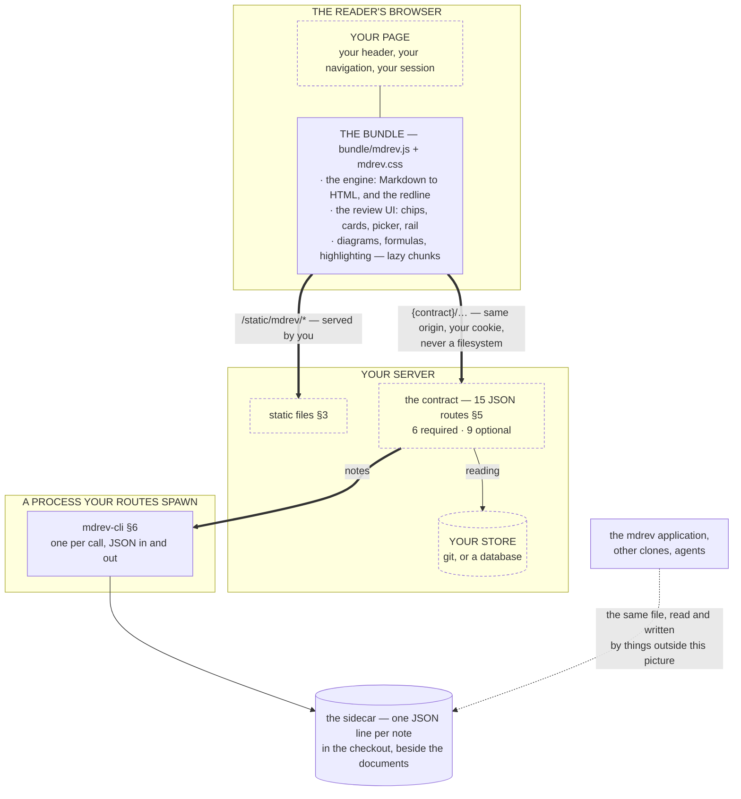
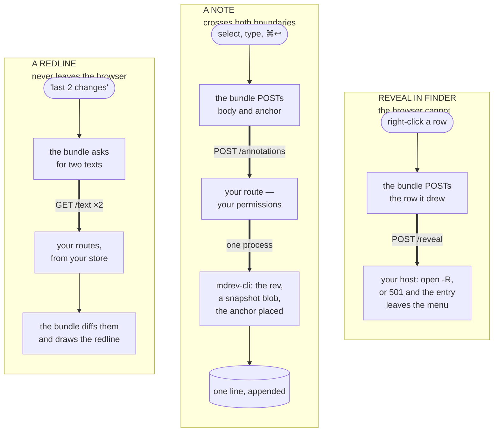

# Embedding mdrev

*mdrev · developer guide · for the team putting mdrev inside their own application*

mdrev renders a Markdown document as a **redline** between two revisions — insertions, deletions and moves marked in the prose, with blame per change — and carries **review notes** anchored to the text, which agents and people act on from the command line. This guide is how to put that inside an application you already have: one that serves Markdown over HTTP, in any language, with its own pages, sessions and routes.

You will serve some static files, add one script to a page, implement six small JSON routes — a handful more if you want the rail, the switcher and the tree — and call one command-line program from the routes that write notes. Nothing of mdrev listens on your machine. The design behind these choices, and its measurements, is in [embedding.md](embedding.md); the exact route specification is [contract.md](contract.md). This guide walks the work in order.

## 1. What is in the box

```text
mdrev-embed-1.1.12/
  README.md
  bundle/              the guest — what the reader's browser runs
    mdrev.js             the entry: an ES module exporting mountMdrev   (~510 KB)
    mdrev.css            the stylesheet, scoped under .mdrev-host       (~88 KB)
    chunks/              lazy pieces: diagrams, math, code grammars     (~5.7 MB, fetched on demand)
    assets/              KaTeX fonts, fetched only by documents with formulas
  mdrev-cli            the command line your annotation routes run
  mdrev-cli.js         (its code, self-contained; the launcher above runs it with node)
  mdrev-v2             the sample host: run it against any git checkout
  mdrev-v2.js
  package.json         one line, so node reads the two .js files as ES modules
  example/             the sample host's source — the worked example, ~3,200 lines
  docs/                this guide, the contract, the design
```

Three things, each with one job:

| | What it is | Where it runs |
|---|---|---|
| **the bundle** | mdrev's viewer, complete: diff, rendering, anchors, diagrams, math, highlighting, the review UI | the reader's browser, served by you as static files |
| **`mdrev-cli`** | mdrev's note store as a program: list, add, reply, resolve, wontfix, reopen, delete — JSON in, JSON out | your server, one short-lived process per call |
| **`mdrev-v2`** | a complete host in ~3,200 lines of TypeScript: serves a checkout, implements the contract, mints capabilities, mounts the bundle in a page of its own, and has the command line to drive it | wherever you want to see the whole thing work before writing your own |

Requirements: **node 20 or newer** and **git** on the machine that runs `mdrev-cli` or `mdrev-v2`. The bundle needs a browser that loads ES modules — every current one. Nothing is installed globally; the tree runs where it is unpacked.

### How the pieces fit

Two boundaries, and everything below is a consequence of where they fall. The
first is the **network**: the bundle runs in the reader's browser and reaches
your server only through the contract's routes, on your origin, carrying your
session. The second is the **process**: your routes reach mdrev's note store
only by running `mdrev-cli`, a short-lived program, one call at a time.

Nothing of mdrev listens on your machine, and nothing of mdrev holds state
between requests. Your application keeps its pages, its sessions and its
documents; mdrev brings a renderer and a note format.



**Reading both pictures.** A **dashed box is yours to build**; a solid one
ships in the release. A **thick arrow crosses a boundary** — the network, or
the process — and in the whole system there are only three places it can
happen, which is the point of this section. A **thin arrow stays on one side**
of both. The **dotted arrow is not a request at all**: it is the same file,
reached by something outside the picture. And the plain line between your page
and the bundle is neither a call nor a crossing — the bundle is mounted
*inside* the page, and once `mountMdrev` returns they are one document.

`mdrev-v2` is the same picture with every box filled in: it *is* a host — page,
routes, store and capabilities — and the one you can read (§10). Run it to see
the whole thing work before you write your own, then keep it as the worked
example of each route.

**Three journeys, traced.** The same picture read as paths — a read, a write,
and a thing only your machine can do. Notice where each one STOPS: the
redline never leaves the browser, a note crosses both boundaries, and a
reveal is a thing the browser cannot do at all. That is the whole of the
routing.



**Where each thing is answered.** The left column is what the reader does; the
rest is which module does the work and what it costs you to offer it. The route
names are written bare here for room — every one of them hangs under **your own
prefix**, the `contract` you pass at the mount, so `/text` is really
`{contract}/text` (§5).

| The reader … | Answered by | You provide, under `{contract}` |
|---|---|---|
| reads a document, plainly | the bundle, in the browser | `GET /text` |
| sees a **redline** between two revisions | the bundle: it fetches both texts and diffs them in the browser — you never render | `GET /text` twice, `GET /revisions` |
| picks a range, or widens one | the bundle's picker, from your revision list | `GET /revisions` |
| sees **blame** per change | the bundle, from the pair-diffs of adjacent revisions | `GET /text` once per revision in the range, cached in the page |
| sees an image, follows a link | your routes; the bundle never names a path it was not given | `GET /asset`, and `POST /resolve` if you gate |
| opens the **rail** of what a range touched | your routes; the bundle only draws it | `GET /changed`, and `/tree` or `/documents` |
| moves to another document or collection | the bundle re-renders in place — no page load — and tells you through `onNavigate` / `onOpenOther` | the listing routes above |
| **files a note** | `mdrev-cli`, through your route | run `notes add`, relay its JSON |
| closes, replies to, reopens a note | `mdrev-cli`, through your route | `notes resolve` / `reply` / `reopen` / `delete` |
| sees a note placed on text that has since moved | `mdrev-cli` at filing time (it stores a snapshot blob) and the bundle at reading time | `GET /snapshot`, or nothing and it searches |
| watches an agent revise the document | your push, or the bundle's poll | `GET /events`: a stream, or **204** for "poll me" |
| right-clicks a row to reveal it on disk | your host — the browser cannot, and will not be asked twice if you answer **501** | `POST /reveal`, optional |
| takes a collection out of the switcher | your host | `POST /forget`, optional |
| acts on a note from the terminal, tomorrow | the `mdrev` application, reading the same sidecar | nothing — it is the same file |

The pattern in that table is the design: **everything about a DOCUMENT is
rendered in the browser, and everything about your STORE, your PERMISSIONS and
your MACHINE is yours.** The viewer asks; it never decides. When a route is
missing the feature that needed it is simply absent — no rail, no switcher, no
reveal — and the rest is unaffected.

### Getting it

The same tree, three ways.

**With Homebrew** — a developer's machine, or any host with Homebrew (macOS or Linux):

```bash
brew install tanghong123/tap/mdrev     # the mdrev application, with the kit inside it
brew upgrade tanghong123/tap/mdrev     # later versions
```

The kit is not a formula of its own on GitHub: it ships inside the `mdrev` application, whose keg you use by path — you copy `bundle/` into your own static files and run `mdrev-cli` from wherever you keep it — and `mdrev-cli` and `mdrev-v2` are linked into `/opt/homebrew/bin` beside `mdrev`. `brew --prefix mdrev` (`/opt/homebrew/opt/mdrev` on Apple silicon) is a path that stays the same across upgrades, so a deployment script can refer to it:

```text
$(brew --prefix mdrev)/libexec                the release tree; the kit is the part of it below
$(brew --prefix mdrev)/libexec/bundle         the guest — copy it into your static files
$(brew --prefix mdrev)/libexec/example        the sample host's source
$(brew --prefix mdrev)/libexec/docs           this guide, the contract, the design
$(brew --prefix mdrev)/bin/mdrev-cli          the commands, with Homebrew's node resolved for you
$(brew --prefix mdrev)/bin/mdrev-v2
```

`brew pin mdrev` holds a version while you qualify the next one; `brew info tanghong123/tap/mdrev` says which is current.

**The tarball, without Homebrew** — a Linux server, a container, a CI job. Every release is on GitHub, tagged `mdrev-1.1.12`, with two tarballs: `mdrev-1.1.12-macos.tar.gz`, the application with the kit inside it, and `mdrev-embed-1.1.12.tar.gz`, the kit alone — the tree above, exactly as unpacked. The name of the first notwithstanding, `mdrev-cli`, `mdrev-v2` and the bundle are pure JavaScript and run wherever node ≥ 20 and git are; only the `mdrev` application's Finder integration is macOS-only:

```bash
curl -LO https://github.com/tanghong123/homebrew-tap/releases/download/mdrev-1.1.12/mdrev-embed-1.1.12.tar.gz
tar xzf mdrev-embed-1.1.12.tar.gz -C /opt        # → /opt/mdrev-embed-1.1.12
```

Unpacked, the tree runs where it is — `/opt/mdrev-embed-1.1.12/mdrev-cli` — with node on the path. The releases page lists the current version.

**From source** — `bash scripts/build-release.sh` in a checkout of the repository emits both tarballs into `dist-release/public/`.

## 2. See it work first — ten minutes

Run the sample host against a git checkout that has Markdown in it:

```bash
tar xzf mdrev-embed-1.1.12.tar.gz
cd mdrev-embed-1.1.12
./mdrev-v2 ~/src/your-docs/README.md --last 3   # or --root ~/src/your-docs for the whole checkout
# mdrev-v2: README.md @ /Users/you/src/your-docs
#   http://127.0.0.1:4600/?path=README.md&from=…&code=…
```

It starts **one** background host and reuses it: every later `mdrev-v2 <file>`, in this checkout or any other, is a URL and a browser tab on that same server. A folder it has not served before is added to its registry as the reader opens it (`~/.mdrev/v2.json`'s neighbour, `roots.json`), so a review that spans repositories is one server and one recents list rather than a process per checkout. `--status` lists the folders it has opened, `--stop` ends it, and `--port` runs a private one instead.

What bounds it is the `allow` list in that same `roots.json`: entries a reader put there themselves, which no automatically-added folder can widen. Set one and a document outside it is refused however it is spelled; leave it empty and the boundary is the folders the reader has opened. That is the sample standing in for the permissions your own application already has — §8.

Open the address it printed — it carries a **one-time code**, good for ten minutes, which becomes a cookie; the address without it works from then on (the sample has no sessions, so this key is how it knows its user; §8). The page is the host's and it is bare: mdrev fills it, because on this host mdrev *is* the application. You get the newest change to the document as a redline, a range picker at the top to widen it, change bars in the margin, and a rail of the other files the range touched. **Your host is the one that will have a header and a navigation of its own** — this one deliberately has none left, so that anything you see on the page came from the guest and you can tell at a glance which side any bug is on. §10 says which parts of the sample to copy and which exist only because the sample became the product. Select a sentence, press `a` (or click the pen that appears beside the selection), type a note, save it with ⌘↩. The chip that appears is a note in mdrev's own store:

```bash
./mdrev-cli notes list --root ~/src/your-docs
```

That listing is what an agent reads; if the `mdrev` application is installed on the same machine, `mdrev --notes` in that checkout shows the same note, because both read the same file: `~/src/your-docs/.mdrev/annotations/<path>.jsonl`. This is the whole point of the arrangement — a note filed in your page is a note in mdrev everywhere the checkout goes, and the other way round.

**The modes, one page.** The sample host mounts the guest with everything on. To see the other ways a host can take mdrev — a plain reader, review without notes, notes without history, no toolbar, a collapsed toolbar with three controls, a dark host, a Chinese one, a document in the page's own flow — open the gallery:

```bash
./mdrev-v2 ~/src/your-docs/README.md --modes
# mdrev-v2: README.md @ /Users/you/src/your-docs
#   http://127.0.0.1:4600/modes?path=README.md&code=…
```

One document, one mount at a time, and beside it the exact `mountMdrev` call that made it and the routes a host must serve for it. `example/modes.ts` is the table; §3 says what each option costs.

Now check the sample against the contract it claims to implement:

```bash
KEY="x-mdrev-token: $(cat ~/.mdrev/token)"
CAP=$(curl -s -H "$KEY" 'http://127.0.0.1:4600/?path=README.md' | sed -n 's/.*data-cap="\([^"]*\)".*/\1/p')

./mdrev-cli conform --url http://127.0.0.1:4600/api/mdrev --path README.md --root ~/src/your-docs \
  --header "$KEY" --cap "$CAP"
```

Eighteen checks pass. Two things there are the sample's and not yours: the header is its key, where your host will want its own session (§9); and `--cap` is the capability it minted for that document, scraped out of its page because that is where a reader gets one too (§8). A host that gates nothing needs neither. When your own host passes the same command, you are done; the rest of this guide is how to get there.

## 3. Serve the bundle

Copy `bundle/` somewhere your server serves static files from, whole. The entry imports its chunks **relative to its own URL** — `mdrev.js` at `/static/mdrev/mdrev.js` fetches `/static/mdrev/chunks/…` — so the directory must stay together under one prefix. Nothing in it is loaded until a document needs it: a document with no diagram or formula costs nine files — the two entries, the engine's runtime, and the highlighter's core and two themes — about 750 KB uncompressed and 220 KB gzipped; diagram renderers, KaTeX and code grammars arrive only for the documents that use them.

Serve `.js` as `text/javascript`, `.css` as `text/css`, `.woff2` as `font/woff2`. The files are content-hashed except the two entries, so `chunks/` and `assets/` can be cached for as long as you like; give `mdrev.js` and `mdrev.css` a short max-age, or version the prefix (`/static/mdrev-0.16/`) when you upgrade. `mdrev-v2` does it in a dozen lines (`example/server.ts`, "the guest, as static files").

## 4. Put it in a page

Decide first how much of mdrev this page takes. There are four real hosts,
and the one you are writing is one of them:

| You serve | The reader gets | You declare |
|---|---|---|
| `/text` and `/asset` only | a Markdown viewer — outline, print, display; and `toolbar` / `controls` are yours | nothing, or `isGit: false` for a right first paint |
| …plus `/revisions` over a checkout | redlines, the range picker, folds, blame | `review: true` for a right first paint; `review: false` to serve history and *not* offer redlines here |
| …plus `/annotations` (no git needed) | notes, replies, a review that stays with the document | `annotate: true` for a right first paint; `annotate: false` to keep notes off this page |
| everything | what `mdrev` itself is | both — as mdrev's own hosts do |

A declaration is a ceiling and a first-paint hint, never the reason
something works: the routes are the floor, and a host that declares nothing
is discovered exactly as before.

```html
<link rel="stylesheet" href="/static/mdrev/mdrev.css">

<main id="main">
  <div id="review" data-path="guides/setup.md"></div>
</main>

<script type="module" src="/static/review.js"></script>
```

```js
// /static/review.js — a file, not an inline script (see §8)
import {mountMdrev} from '/static/mdrev/mdrev.js';

const el = document.getElementById('review');
const mounted = mountMdrev(el, {
  contract: '/docs/api/mdrev',            // where your routes live (§5)
  path: el.dataset.path,                  // the document, as your routes name it
  range: {last: 1},                       // the newest change, as a redline
  onNavigate: (path, range) => {          // the reader moved: remember it if you like
    const q = new URLSearchParams({path});
    if (range.from) q.set('from', range.from);
    if (range.to !== 'WORKTREE') q.set('to', range.to);
    history.replaceState(null, '', '?' + q);
  },
});

// show another document without losing the reader's place, notes or range:
mounted.open('guides/deploy.md');

// ...or one in a different collection: a client for that root, swapped into
// the same page. The reader keeps the tree they opened and the notes they
// left; only the document changes. `cap` is the capability the row carried,
// and `isGit` — if you know it — spares the viewer a round trip to find out.
mounted.open('README.md', undefined, {root: otherRoot, cap, isGit: true});

// print the document, from your own menu or shortcut:
mounted.print();

// later, if the page removes the element:
mounted.unmount();
```

The options, all of them:

| Option | Meaning | Default |
|---|---|---|
| `contract` | the prefix your routes answer under; every fetch the viewer makes goes to `{contract}/…` on the same origin | required |
| `path` | the document, in whatever form your `/text` route accepts | required |
| `range` | what to show first: `{last: N}` — from the Nth most recent revision to the document as it stands; or `{from, to}` with revision ids from your `/revisions`; `from: null` reads the document plainly; `to` left out means "as it stands" | a plain read |
| `rangeAsked` | the reader asked for `range` **just now**, in so many words — a command line, a "what changed since Tuesday" control. mdrev remembers the mode each document was last read in, and that memory outranks the range a page opens with: right for a reload, a bookmark or a shared link, wrong for a range a reader named a second ago, which came up clean and read as "nothing changed". The viewer cannot tell those apart — both arrive as nothing but a range — so this is you saying which you have. Leave it out for a page that is merely showing a range it was holding. Read once, at mount: a move to another document goes back to that document's own preference. Setting it also makes the viewer call your `onNavigate` once at mount, with the very path and range you passed — that is how the claim is spent, so the address you keep no longer carries it into a reload | `false` |
| `onNavigate(path, range)` | the reader chose another range or document. `range` is `{from, to}`; `to === 'WORKTREE'` is "as it stands", `from === 'EMPTY'` is "before the first revision", `from === null` a plain read. The viewer never touches your URL — this is how you keep it in step | — |
| `onOpenOther(root, path, cap)` | the reader picked a document from somewhere else — a recents row, a tree leaf, a link out of this collection. `root` is your own opaque name for the collection, handed back exactly as `/recents` or `/tree` gave it, and `cap` is the capability that row carried, if you minted one. Answer it with `mounted.open(path, undefined, {cap})` when the collection is the one already mounted and `mounted.open(path, undefined, {root, cap})` when it is not — **pass the `cap` either way**: a capability is minted for a (collection, path) pair, so the one that opens a sibling is not the one the mount was given, and a move inside a collection that drops it leaves the viewer asking with the wrong capability or none — **not** by navigating the page: a reload costs the reader everything the viewer was holding, the file tree's open branches included. Left out, the viewer has nowhere to send the click | — |
| `fileRail` | show the rail beside the document — the files a range touched, and your `/tree` of everything else. Needs `/changed`, and `/tree` or `/documents`, or it has nothing to list. It gives way to the document: where your mount cannot keep a 600px reading column beside it (and beside a pinned outline), the rail is not drawn, and it returns as the reader left it when the mount is wide enough | `false` |
| `toolbar` | for a **plain reader** — a host serving `/text` and `/asset` and no more: `'none'` shows no toolbar at all (the keys still work), `'collapsible'` opens one on demand, `'always'` is today's. Honoured only while neither history nor notes is in play: the moment your host offers `/revisions` in a checkout or `/annotations`, the toolbar is present and its controls are not yours to hide — the range picker is what review *is*, the notes control what annotation *is* | `'always'` |
| `controls` | which of a plain reader's controls are on the toolbar: `{outline, display, wrap, column, print, fullscreen, source}`, each `true`/`false`, absent meaning on. A hidden control is gone, not greyed. Same rule as `toolbar`: a plain reader only | all on |
| `theme` | `'light'`, `'dark'` or `'system'`: the host owns the theme, and the viewer drops its own control rather than offer a second switch that can disagree with yours. Left out, the viewer keeps the control and remembers the reader's choice | the viewer's |
| `locale` | the viewer's own words, in the reader's language: `'en'` or `'zh-Hans'`. Not the document's script — that is `lang` — and a Chinese document does not imply a Chinese reader. When your application has a language setting it has already asked, so say it here: it outranks the reader's own choice and the browser's preference, and the viewer shows no language control, as with `theme`. A host fact, unchanged by a move between folders. Left out, the reader chooses in the display menu, or `navigator.languages` decides | the reader's |
| `reloadToken` | bump it to re-read the document. For a shell where the file changes under the reader's own hand — an editor — because refetching keeps their scroll, their open notes and their range where remounting would lose all three | — |
| `client` | answer the contract in-process instead of over HTTP, for a shell that already HAS the documents: an editor plugin, a desktop application, anything embedding the core. It replaces every fetch; `contract` is then unused | fetches |
| `scrollParent` | the element that scrolls, when the viewer is one section of a page you scroll: an element, or `'page'` for the document itself. Left out, the viewer fills its element and scrolls inside it | own pane |
| `onPrint()` | you print your own way. The toolbar keeps its print control either way — putting THIS document on paper is what you embedded the viewer for; this says only who carries it out. Left out, the guest prints the document alone (below) | the guest prints |
| `credentials` | the `fetch` credentials mode; `'same-origin'` sends your session cookie | `'same-origin'` |
| `root` | **which collection these documents belong to**, your own opaque string, sent with every request. A host that holds more than one store of anything needs it: a path stops identifying a document as soon as two projects each have a `README.md`. One store, leave it out | none |
| `isGit` | whether this collection has history at all. Everything that only means something WITH history — the picker, the redline switch, the rail, blame — is hidden when it is `false`. Left out, the viewer ASKS (the document's revisions, then the collection's), so this is an optimisation for the first paint and never load-bearing | asked |
| `review` | your leave for history, a **ceiling**: `false` hides the redline switch, the picker, folds and blame even over a checkout — the one thing `isGit` cannot say, since `isGit` is a fact and this is a choice. `true` grants nothing the routes do not serve. Left out, discovered. Per collection, like `isGit`: say it for the collection being moved to, or say none | discovered |
| `annotate` | your leave for notes, the same shape: `false` hides the notes control and the selection invite even where `/annotations` answers; `true` grants nothing without the route. With both `review` and `annotate` effectively off the document is a **plain reader**, and `toolbar` / `controls` take effect | discovered |
| `caps` | capabilities for more than one document at once, `{path: cap}`, where `cap` gives one. The listing routes hand theirs over as rows arrive, so this is for what the host knows up front | none |
| `trustHtml` | let raw HTML in documents RUN — scripts included. Off, it renders with everything executable removed (§8) | `false` |
| `cap` | the capability your routes will check for `path`, if you gate reads (§8) | none |

**Sizing.** Without `scrollParent`, the viewer is `height: 100%` of its element and scrolls its own pane, so the element needs a height: in a flex column, `#review { flex: 1; min-height: 0 }` (that is `mdrev-v2`'s page). With `scrollParent`, the element grows to its content and your container scrolls; the viewer measures against that container for its change bars and note chips.

**Printing.** The toolbar has a print control, and `mounted.print()` is the same
action for your own menu or shortcut. It borrows the document's name for the
length of the print — a browser takes the PDF's filename from `document.title`
— and gives your title straight back; and because the viewer's stylesheet is
scoped under the mount and so can say nothing about your header or sidebar, it
isolates the mount for the duration so your application does not come out on
the paper with the document. Pass `onPrint` and none of that happens: you print,
and you decide what belongs on the sheet.

**Keyboard.** The viewer's shortcuts (`a` annotate, `n`/`p` next and previous change, `[` `]` widen the range, `Escape`) act only while the reader is engaged with the mount — a click or focus inside it — so they do not collide with yours.

**Pinch.** Over a diagram or an image the viewer takes the pinch gesture and sizes THAT PICTURE, rather than letting the browser zoom your whole page to inspect one flowchart. It is taken nowhere else: a pinch over the prose, your header or anything outside a picture is left alone, so page zoom stays the reader's. (A pinch reaches a page as a `wheel` event with `ctrlKey`, which is also what ctrl+wheel sends from a mouse; both do the same thing here.)

**Theme.** Every colour is a token with a fallback: set any of these on the element or an ancestor and the viewer follows. It picks light or dark from `prefers-color-scheme` on its own; a host with its own dark switch sets the tokens under its own selector.

```css
.mdrev-host {           /* the class mountMdrev puts on the element */
  --mdrev-bg: #fff;        --mdrev-bg-soft: #f6f7f8;  --mdrev-bg-inset: #eef0f2;
  --mdrev-ink: #1f2933;    --mdrev-ink-soft: #52606d; --mdrev-ink-faint: #9aa5b1;
  --mdrev-rule: #d9e2ec;   --mdrev-rule-soft: #e8eef4;
  --mdrev-accent: #0b6e4f; --mdrev-accent-soft: #e3f3ec; --mdrev-on-accent: #fff;
  --mdrev-code-bg: #f4f5f7;
  --mdrev-ins-bg: …; --mdrev-ins-fg: …;   /* inserted text */
  --mdrev-del-bg: …; --mdrev-del-fg: …;   /* deleted text */
  --mdrev-mod-bg: …; --mdrev-mod-fg: …;   /* a changed block's bar */
  --mdrev-shadow: …;
}
```

Set only what you want to change; the rest keeps mdrev's own look. The stylesheet is scoped under `.mdrev-host` — none of its rules reach your page, and yours reach the viewer only through the tokens.

**Rendering without mounting.** The same module exports the engine, for a preview or a static page rendered with the same code the viewer uses:

```js
import {engine} from '/static/mdrev/mdrev.js';
engine.renderPlain(markdown).html;
engine.renderDiff(before, after);        // {html, changes, stats}
```

**Raw HTML in the documents.** Markdown is half HTML, and people write it:
`<details>` around a long log, ``, `<kbd>`, `<div align="center">`.
mdrev renders all of it and drops everything that executes — `<script>`,
`<iframe>`, every `on*` handler, every URL outside `http`, `https` and
`mailto` — which is what GitHub, GitLab and Obsidian each do, and the default
here. Pass `{html: 'escape'}` to show the HTML as source instead, or
`{html: 'trust'}` to pass it through untouched; `trust` is only for documents
the reader wrote, since `` in one document runs in every reader's
session. `mountMdrev`'s `trustHtml` option is the same switch for the viewer.

## 5. Implement the contract

Fifteen routes under the prefix you gave as `contract` — six you must answer, nine you may, plus `POST {contract}/resolve` if you mint capabilities (§8).

**None of these paths is fixed, so none of them can collide with yours.** Only the last segment is mdrev's — `text`, `revisions`, `annotations` — and the whole set hangs under whatever prefix you passed as `contract`: `/docs/api/mdrev`, `/internal/review/v2`, anything on your origin you already own. Mount two viewers against two prefixes if you like. Nothing in the bundle contains an absolute URL; every request it makes is `{contract}/<route>`, and `bundle/` is likewise served from wherever you copied it (§3) — the one rule there being that the directory stays together, since the entry loads its chunks relative to its own URL.

What is fixed, and is worth a moment if you are fitting this to a framework that reserves names: the final segment of each route, the sub-paths `annotations/{id}` and `annotations/{id}/replies`, and the query parameters the viewer sends — `path`, `rev`, `blob`, `cap`, `root`, `node`, `from`, `to`, `since`. Everything else is yours. Reading is store-agnostic: `text`, `revisions`, `asset`, `changed`, `recents`, `stat`, `documents` and `events` want two texts, an opaque revision id and a list or two, and a host can answer every one from a database with no files. Notes are the half written in git's terms — see [what needs a checkout](contract.md#what-needs-a-checkout-and-what-does-not); answer `GET /annotations` with `[]` and refuse the writes, and you have the document, its history and its redline without them. Every one is a same-origin request carrying your session; what a session may read, and which `path`s exist, is entirely your decision — the viewer never sees a filesystem. Errors are `{"error": "…"}` with a fitting status: 400 bad request, 403 may not, 404 not there. [contract.md](contract.md) has every shape; this is the table to build from.

| Route | Returns | Notes |
|---|---|---|
| `GET /text?path=&rev=` | the Markdown, `text/plain; charset=utf-8` | `rev` is an id from `/revisions`, or `current` for the document as it stands. Send an `ETag`; the viewer polls with `If-None-Match` when you have no push, and a 304 is free. Refuse `..` |
| `GET /revisions?path=` | `[{rev, date, author, subject, body?}]`, **newest first** | `rev` must be the **git commit id** if notes are to be shared with the mdrev application, because a note records the revision it was taken on. `[]` means no history: the viewer is then a reader with notes. **With no `path`** — optional — the COLLECTION's own revisions, which is how the viewer tells "this folder has no history" from "this document has none yet" |
| `GET /asset?path=` | the file, with its media type | images a document refers to; same root and refusals as `/text` |
| `GET /annotations?path=` | `[note]` | `mdrev-cli notes list --path P --all --root R`, returning each item's `annotation` (§6) |
| `POST /annotations?path=` | the note as stored, **201** | `mdrev-cli notes add --path P --root R` with the request body on stdin |
| `PATCH /annotations/{id}?path=` `POST /annotations/{id}/replies?path=` `DELETE /annotations/{id}?path=` | the note as it now is; 204 for delete | `notes resolve\|wontfix\|reopen ID --note "…"`, `notes reply ID --body "…"`, `notes delete ID`. A read-and-file-only host may answer 501 |
| `GET /documents` — optional | `{files: [{path, cap?}]}` | every document you hold, for the viewer's switcher — not what changed, not what was opened. `git ls-files -- '*.md' '**/*.md'`. Gating? Mint a `cap` **per row**, or the rows are documents the viewer may name and not open |
| `GET /snapshot?blob=` — optional | the text a note was taken on, `text/plain` | `git cat-file -p <blob>`. With it, notes are placed by walking the diff from that text — exact; without it, by searching for the quote |
| `GET /tree?node=` — optional | `{nodes: [{id, label, kind, root?, path?, cap?, count?, removable?}]}` | your documents arranged your way, one level at a time. `kind` is `branch` (opens; pass its `id` back) or `doc` (carries `root`/`path` to open). A BRANCH is asked for only when it is opened; the TOP level is asked for once per collection whether or not the reader opens the section, because its header carries `count`. A branch need not be a directory. `count` is how many documents are under it — **leave it out when knowing would cost more than the number is worth**, and the row simply has no badge |
| `GET /changed?from=&to=&since=` — optional | `{files: [{path, status, cap?}]}` | what a range touched, for the rail. `status` is `A`/`M`/`D`/`R`; a rename is named by where it ended up. `EMPTY` as `from` means before the first revision. `since` is an instant, sent when the reader picked a WINDOW ("the past week") rather than two revisions — answer the window literally, not the commit it resolved to. Gating? A `cap` **per row**, as for `/documents` |
| `GET /recents` — optional | `[{root, path, at, label?, cap?}]`, newest first | what this reader opened lately, for the switcher. `root` is your opaque name for the collection — handed back, never parsed; send a `label` for what to call it on screen. Span every collection you hold: filtered to the one on screen, it cannot do its job |
| `GET /stat?path=&cap=` — optional | `{mtimeMs}` | when the document was last written, or `null`. Shown beside its name; nothing shown without it |
| `POST /reveal` — optional | `{ok: true}` | show a file to the person at the machine — the rail's right-click menu. The body names the row: a document by its `path` and the `cap` its listing minted, plus the `root` of the row's OWN collection when that is not the one in the query; a folder by the node id `/tree` gave it, with `folder: true`. **501 means you never can** and the viewer drops the entry; `403`/`410`/`5xx` are about that one row and it keeps offering the rest |
| `POST /forget` — optional | `{ok: true}` | stop listing a collection — the same menu, on a top-level row you marked `removable`. Refuse with a reason rather than letting a row be offered an entry that fails |
| `GET /events?path=` — optional | `text/event-stream`, or **204** | 204 means "poll"; answer that unless you already have push (§7) |

**The viewer asks for the optional ones anyway.** It has no way to know which
you built, so it tries; a 404 is a perfectly good answer and it simply does
without — no rail, no switcher, no time beside the name. What that costs you is
cosmetic and worth knowing before it surprises you: those 404s show up in the
browser's console on every page load, in red, next to nothing that is actually
wrong. Answering `{"files": []}` or `[]` instead of 404 quiets them, and says
the same thing.

Texts and revisions come from **your** store, however you keep it. `mdrev-v2` keeps them in git and answers `/text` with `git show <rev>:<path>` and `/revisions` with one `git log --format=…` — see `example/server.ts`, which is short enough to read top to bottom. If your documents are in git, those two commands are the whole backend; if they are in a database, the same two routes over your tables.

## 6. Notes, through mdrev-cli

Notes are mdrev's, not yours: they live in mdrev's **sidecar** — `<checkout>/.mdrev/annotations/<path-to-doc>.md.jsonl`, one JSON record per line — and `mdrev-cli` writes them. Your annotation routes are thin: run the command, relay its output, map its exit code. That is the reason there is one implementation of the record, the revision resolution and the content snapshot, and nothing for a second one to drift from.

Install the `mdrev-embed` tree on the machine that runs your server (§1, *Getting it*), with node on the path, and run `mdrev-cli` from it by its full path. Every call takes `--root <checkout>`. `--author <who>` is optional: a host with more than one reader passes the session's user so the note says who filed it; without it a note is by the server's user, which is fine for a single-user host (`mdrev-v2` does that).

| Your route | Run | stdin | stdout |
|---|---|---|---|
| `GET /annotations` | `mdrev-cli notes list --path P --all --root R` | — | `[{path, annotation, state, currentText}]` — return the `annotation`s |
| `POST /annotations` | `mdrev-cli notes add --path P --root R --author U` | the request body: `{body, anchor, type?}` | the stored note, with `id`, `rev`, `blob`, `created`, and the anchor placed |
| `POST …/{id}/replies` | `mdrev-cli notes reply ID --body "…" --root R --author U` | — | the note |
| `PATCH …/{id}` `{status: "resolved"}` | `mdrev-cli notes resolve ID --note "…" --root R --author U` | — | the note, with `resolvedBy` |
| `PATCH …/{id}` `{status: "wontfix"}` | `mdrev-cli notes wontfix ID --note "…" …` | — | the note |
| `PATCH …/{id}` `{status: "open"}` | `mdrev-cli notes reopen ID …` | — | the note |
| `DELETE …/{id}` | `mdrev-cli notes delete ID --root R` | — | `{deleted, path}` |

One verb has no route, because it is housekeeping rather than a reader's action: `mdrev-cli notes follow-renames [--path P] [--from OLD --to NEW] --root R` moves each note whose document was renamed into that document's sidecar (notes are read across a rename without it; this is for keeping the records where the documents are), and `--from OLD --to NEW` says two names are one document when git could not pair them. `docs/renames.md` has the rules.

Exit codes: **0** done, **1** a bad request (message on stderr, prefixed `mdrev-cli: `), **2** no such note or document. Map them to 200/201, 400, 404. The sketch below, in Rust, is the whole of a route; `example/server.ts` has the same in TypeScript.

```rust
// POST {prefix}/annotations?path=…   (Rust, std only, illustrative)
let out = Command::new("/opt/mdrev/mdrev-cli")   // wherever you keep the tree (§1, Getting it)
    .args(["notes", "add", "--path", &path, "--root", &checkout, "--author", &session.user])
    .stdin(Stdio::piped()).stdout(Stdio::piped()).stderr(Stdio::piped())
    .spawn()?;
out.stdin.as_ref().unwrap().write_all(request_body)?;
let done = out.wait_with_output()?;
match done.status.code() {
    Some(0) => (201, "application/json", done.stdout),
    Some(2) => (404, "application/json", error_json(&done.stderr)),
    _       => (400, "application/json", error_json(&done.stderr)),
}
```

What `add` does with the record it is given: resolves the revision the document is at (`rev`), writes a content snapshot of the document into the git object store (`blob`, so the note can be mapped *exactly* through later edits rather than searched for), locates the anchor in the source and records its offsets, mints an `id`, appends the line. The viewer sends a full anchor; a route of your own, or an agent, may send a quote alone:

```bash
echo '{"body": "tighten this", "anchor": {"exact": "small corpus"}}' \
  | mdrev-cli notes add --path README.md --root ~/src/your-docs --author reviewer@example
```

```json
{
  "author": "reviewer@example", "status": "open", "type": "comment", "body": "tighten this",
  "anchor": {
    "exact": "small corpus", "start": 15, "end": 27,
    "prefix": "# Your docs\n\nA ", "suffix": " to try mdrev on. The setup guid", "trail": [], "space": "source"
  },
  "rev": "24d4995784b54a61bd008397f514e1889c5a7163",
  "blob": "0c1f4b2e6a6f0d9f4a5b1e6c2d3a4b5c6d7e8f90",
  "path": "README.md", "id": "ann-mtktuosa-cucu", "created": "2026-09-03T00:52:10.085Z"
}
```

`start` and `end` are offsets into the Markdown source; `prefix` and `suffix` are the 32 characters around the quote; `trail` is the heading path when the filer knows it. A quote that occurs nowhere in the document is stored as given, and the viewer shows it in its off-page stack rather than beside text it cannot find.

Three things to decide:

- **Concurrency.** The CLI rewrites the sidecar on every change but create. Serialise the calls for one document — a mutex keyed by `path` in your process is enough — so two closes at the same instant cannot lose one another. Two *clones* are git's ordinary merge of a line-per-record file.
- **Whether notes travel.** mdrev writes a self-ignoring `.mdrev/.gitignore` beside the sidecars, because a local review is private. A host whose notes should be seen by mdrev on other machines **deletes that marker and commits `.mdrev/`** — that is the switch, and the file says so.
- **Permissions.** Who may file, close or delete whose note is yours, applied at the routes before the command runs; `mdrev-cli` enforces none.

Two more verbs for a host that would rather not read git itself: `mdrev-cli text --path P [--rev R]` and `mdrev-cli revisions --path P` answer `/text` and `/revisions` in the contract's shapes.

## 7. Live reload

While an agent rewrites a document, the reader's redline follows it. Two ways to provide that, and the viewer takes whichever you offer:

- **Push.** `GET /events?path=` returns a `text/event-stream` and sends `event: change` (any data) when the document changes. `mdrev-v2` watches the directory and does this in thirty lines.
- **Poll.** `GET /events` returns **204**. The viewer then re-fetches `/text?rev=current` every few seconds while its tab is visible, with `If-None-Match`; your `ETag` turns each poll into a 304.

Start with 204. Add the stream when you have a change signal to hand.

## 8. Security

Your documents are other people's. Three lines of defence, in the order they matter:

1. **Filtered HTML, on by default.** A document's raw HTML renders — `<details>`, `<kbd>`, ``, `<div align>` — and everything in it that executes does not: `<script>`, `<style>`, `<iframe>` and their contents are gone, every `on*` handler is stripped, and link and image URLs are held to `http`, `https`, `mailto` and relative paths (`javascript:` and `data:` are dropped). The parse is the platform's — `template.innerHTML` in a browser — because a hand-written tag stripper is where mutation XSS lives. A host whose authors it trusts sets `trustHtml: true`; don't unless you have a reason.
2. **A Content-Security-Policy on the page**, so that anything that slipped through could not run. This is the whole header the guest needs:

   ```text
   Content-Security-Policy: default-src 'none'; script-src 'self'; style-src 'self' 'unsafe-inline';
     img-src 'self' data: blob: https: http:; font-src 'self'; connect-src 'self'; base-uri 'none'; form-action 'none'
   ```

   `script-src 'self'` is why the mount script in §4 is a file: no inline script runs under it. `style-src 'unsafe-inline'` is the one allowance — diagrams, formulas and highlighted code all write inline styles. `img-src` admits `https:` and `http:` because a document's pictures are often not on the host that serves the document, and refusing them shows the reader an empty box rather than a picture; `connect-src 'self'` still stands, so an image URL is the only outbound channel this page has. A host that would rather not fetch from anywhere sends a narrower `img-src` of its own — this policy is the sample host's, not the guest's requirement. `mdrev-v2` sends exactly this and renders diagrams, math and code under it with no violation. If you send a CSP today, merge these sources into it; if you send none, the guest needs nothing.
3. **Your session, on every request.** The viewer fetches with `credentials: 'same-origin'`, so a cookie your page already has is sent without being told, including on the event stream. It puts nothing in a URL beyond `path`, `rev`, `blob`, `cap`, `root`, `node`, `from`, `to`, `since` and note ids — no token of yours can leak through a request it makes. If your session arrives as a key in the page URL, rewrite it into a cookie *before* serving the page that mounts the viewer, so the first fetch already carries it.
4. **Capabilities, if a path is not the same as permission.** A session says the reader may ask. It says nothing about what they may NAME, and your `path` parameter is a name they choose. If that gap matters — and it does the moment one reader's documents are not every reader's — mint a capability per document and require it:

   ```js
   mountMdrev(el, {contract: '/docs/api/mdrev', path, cap: capabilityFor(user, path)});
   ```

   The viewer then sends `&cap=…` on every route about that document, and asks `POST {contract}/resolve` for anything the document points at — one round trip per render, with the referring document named, so your answer can depend on where the reference came from. A path you will not mint for comes back `null`, and the viewer draws that image or link as refused instead of requesting it. [contract.md](contract.md) has the shapes.

   Said plainly, because it is easy to oversell: this does not stop a reader from asking your page for a document. It stops the VIEWER — and anything running alongside it in that page — from naming a file you did not offer. What makes that worth having is where the check lands: one place, per reference, where your own permissions already live.

Diagrams render with mermaid at `securityLevel: 'strict'`, formulas with KaTeX at `trust: false`, both in the reader's browser from text you served — the same trust boundary as the Markdown.

**The sample, worked through.** `mdrev-v2` has no sessions, so it stands in for one: it listens on the loopback interface only, refuses any `Host` but its own (which closes DNS rebinding), and answers only a request carrying its key — a random secret kept at `~/.mdrev/token`, mode 0600, so another account on the same machine cannot read it. The address it prints carries a **one-time code** derived from that key, good for ten minutes and spent on first open, because a printed address ends up in shell history and in screenshots; the page turns it into a `SameSite=Strict` cookie and drops it from the address bar. A command line sends the key itself as `x-mdrev-token`.

On top of that it does the capability half in about forty lines, and that part is not a stand-in — it is the pattern:

- The page mints for the document it serves, **and only for a document git tracks**: an untracked key sitting in the directory is not something the host ever offers, so there is no first link in the chain for it.
- `POST /resolve` mints for what a held document points at, and for nothing else.
- `--allow <dir>` puts a floor under the whole chain: repeatable, the root by default, and no sequence of references can end up outside it however a document spells the path.

The three together are the answer to "what can a reader of one document reach": that document, what it points at, and nothing outside the boundary. Swap the boundary check for your own permissions and you have the same thing for real users.

## 9. Check it

```bash
mdrev-cli conform --url https://docs.example/docs/api/mdrev --path guides/setup.md \
  --root /srv/docs --header "Cookie: session=…"
```

It exercises every route and every shape, the refusals, and the round trip: files a note through your routes, finds it in the sidecar with the same code `mdrev --notes` uses, closes it, deletes it. The checks:

```text
✓ GET /revisions — 2 revisions, newest first
✓ GET /text?rev=current — 324 chars
✓ GET /text?rev=<oldest> — 217 chars
✓ GET /text for a missing document — 404
✓ GET /text refuses a path that escapes the root — 404
✓ GET /asset — text/plain; charset=utf-8
– GET /changed — not offered: the viewer shows no changed-files rail
– GET /recents — not offered: the viewer shows no switcher of recent documents
– GET /stat — not offered: the viewer shows no time beside the name
– GET /documents — not offered: the viewer shows no switcher
✓ GET /events — 204: the viewer polls
✓ GET /annotations — 0 notes
✓ POST /annotations — ann-mtktuosa-cucu at rev 24d4995, with a snapshot blob
✓ rev is a git commit — 24d4995784b54a61bd008397f514e1889c5a7163
✓ GET /annotations lists the new note
✓ the note is in the sidecar mdrev reads — state exact
✓ PATCH /annotations/{id} — resolved
✓ DELETE /annotations/{id} — back to 0 notes

conforms (4 optional parts skipped)
```

That is a host that answered the six required routes and nothing else — the
smallest thing that conforms. Build the optional ones and those four dashes
become ticks, which is what `mdrev-v2` scores. A host that gates reads answers
**403** where this one answers 404, and the runner takes either: a refusal is a
refusal.

Optional parts you lack are reported as skipped (`–`), never as failures; `--json` gives the same list as data; exit 0 conforms. `--root` names the checkout your host serves so the runner can read the sidecar directly — run it on the host's machine, or against a mount of the same checkout; without `--root` that one check is skipped. Run it in CI against a staging host: it takes a second.

## 10. Reading the sample

`example/` is `mdrev-v2` as source, deliberately small, and organised the way this guide is:

- `server.ts` — `createHost()`: the static files, then the contract route by route. `inside()` is the path guard; `mdrev()` is how a command line is run and its exit code read; the `annotations` block is §6 in forty lines; `subscribe()` is the push half of §7; `CSP` is §8.
- `page.ts` — the page, and `HOST_SCRIPT`, the mount of §4 as the file the policy requires. **Do not copy this one's layout.** It had a header, a file list and a column, which is what a host looks like and what this guide showed you; then `mdrev` began dispatching to this host by default, and chrome announcing itself as a sample became a lie about what the reader was looking at. So it is now the mount and nothing else. What to take from it is the *mount*: the element that carries `data-path`, `data-cap` and `data-contract`, the range read from the address rather than hardcoded, and `onNavigate` writing it back so a reload and a shared link land where the reader was. Put those inside whatever chrome your application already has.
- `bin.ts` — the command line. Note `defaultCli()`: the sample runs the `mdrev-cli` beside it, which is the layout this release ships.
- `roots.ts` — which folders this host will serve, and the file it keeps them in. This is the sample standing in for the permissions your application already has (§8): `allow` is a ceiling a reader sets, `opened` is the working set that grows as they open documents, and a path is servable only when it is inside both.
- `daemon.ts` — how one background host is found, started and stopped, so that every later `mdrev-v2 <file>` is a browser tab on the server already running. Nothing here is about the contract; it is the sample being an application.

It is written for a git checkout because that is what this repository reviews its own documents with; the shape carries to any store. `mdrev-v2` is also the next mdrev application rather than a demonstration of one — `mdrev` opens it and `mdrev --legacy` opens the viewer it replaces — which is why the sample is a host you can read, and why its page stopped looking like a sample.

## 11. Upgrading, and what stays stable

- Upgrade the **bundle and `mdrev-cli` together**, from one release. They share the note record and the anchor format; a mismatch shows as notes that place by search instead of exactly, not as breakage. With Homebrew that is one command, `brew upgrade tanghong123/tap/mdrev`, since both are one keg; with the tarball, unpack the new version beside the old and switch your static files and your `mdrev-cli` path in the same deploy.
- The **sidecar is append-and-rewrite JSON lines** and has only gained fields. Notes filed by an earlier version keep working; a record a newer version writes carries fields an older reader ignores.
- The **contract** is versioned with this guide. Routes are added, not changed; a host that passes `conform` today passes it after an upgrade until the runner says otherwise, and the runner is the definition.
- The two entries, `mdrev.js` and `mdrev.css`, are not content-hashed; version their URL prefix or give them a short cache life.

Numbers, so that expectations are set: in a current Chrome the redline of a 100 KB document appears in about a tenth of a second, a 400 KB one in under half a second, once per range change, with the page usable meanwhile; a plain read is a few milliseconds per 10 KB. Range blame — which revision introduced each change — costs one `/text` per revision in the range, cached in the page; for the usual range, the newest change, that is two.
